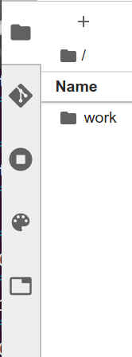
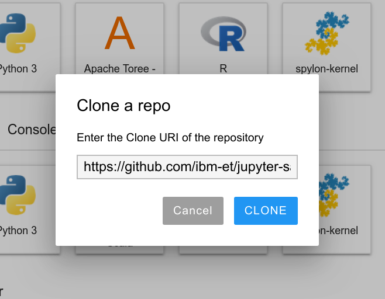
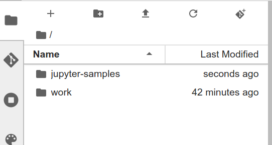
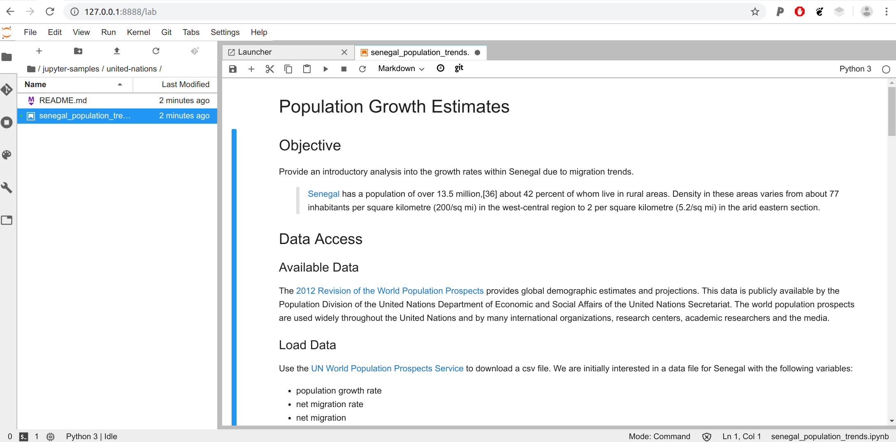
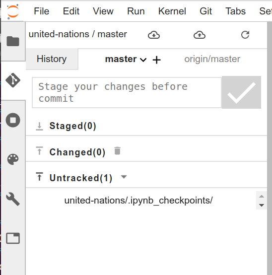
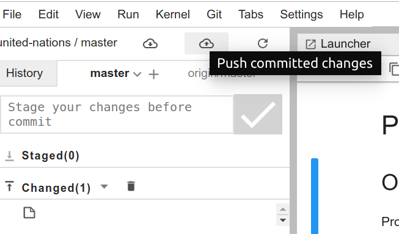

# JupyterLab Git

This is an example Docker container to test [jupyterlab-git](https://github.com/jupyterlab/jupyterlab-git), 
which would allow for easy interaction with a git repository from JupyterLab. The container
could connect to whatever git repository endpoints would be allowed anyway, and permissions
for the git repository (updating and access) would be controlled by the provider of git.

## Build

You can optionally build the container as follows:

```bash
docker build -t vanessa/jupyterlab-git .
```

It's optional because I've pushed [this example](https://hub.docker.com/r/vanessa/jupyterlab-git) 
that you can use directly from DockerHub.

## Run

You can then run the container:

```bash
$ docker run --rm -p 8888:8888 -p 4040:4040 -e JUPYTER_ENABLE_LAB=yes -v ~:/home/jovyan/work vanessa/jupyterlab-git
```

Look for the url to open here:

```bash
[I 12:50:01.964 LabApp] The Jupyter Notebook is running at:
[I 12:50:01.964 LabApp] http://f0439ddda4cd:8888/?token=4abbc2bac18c9b61f5b48c7fa4f25256291bbaa0096cd7c0
[I 12:50:01.964 LabApp]  or http://127.0.0.1:8888/?token=4abbc2bac18c9b61f5b48c7fa4f25256291bbaa0096cd7c0
```

You need to use the *second* of those two.

## Usage

When you have installed the [jupyterlab-git](https://github.com/jupyterlab/jupyterlab-git)
extension, this adds a "git" tab on the left side of the page.



And you can easily clone a repository into the workspace. Let's try cloning [https://github.com/ibm-et/jupyter-samples](https://github.com/ibm-et/jupyter-samples) which has a lot of good examples.



The repository should appear in the workspace (so you would want to navigate to the
place you want to clone it first.)



Here is opening the notebook under the united-nations folder:



The git tab now has a nice interface for selecting a branch, writing a commit message,
and making a commit,



The tab at the top then has buttons to pull and push staged changes (staging comes down
to pushing the up arrow next to the changed button, which is not done in this image.)



And it will ask you to enter your username and email when you commit. That's it! It seems
to be an easy plugin to interact with Git from JupyterLab directly without needing
the command line.
